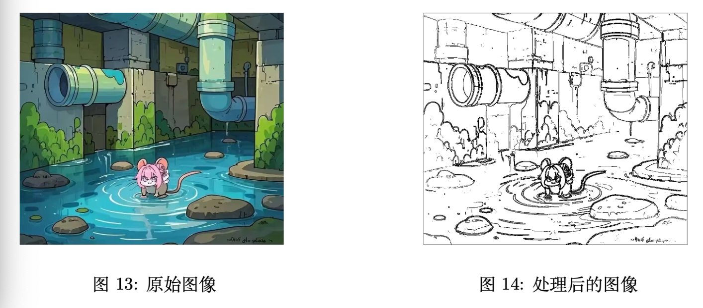

# Project 3: BMP Image Processor

> Part of [SUSTech CS219 Projects](../README.md)

## 📖 Introduction

本项目实现了一个基于 **C (C11)** 的命令行 **BMP 图像处理工具**，支持 24 位无压缩格式。

项目采用了 **线性内存存储** 以提升 **Cache Hit Rate**，并配合 **OpenMP** 多线程与 **GCC Auto-Vectorization (SIMD)** 实现了对图像算法的加速。

## 📸 Demo

 

## ⚡️ Supported Operations

*   **Basic**: `add` (亮度), `average` (图像融合), `grayscale` (灰度化), `flip` (镜像翻转).
*   **Advanced**:
    *   **Box Blur**: 优化的滑动窗口算法 (Sliding Window)，复杂度 $O(N)$。
    *   **Sobel Edge Detection**: 基于卷积算子的边缘检测。

## 🖋 Feedback

Grading: 98/100

Comment from Instructor: 很好！
